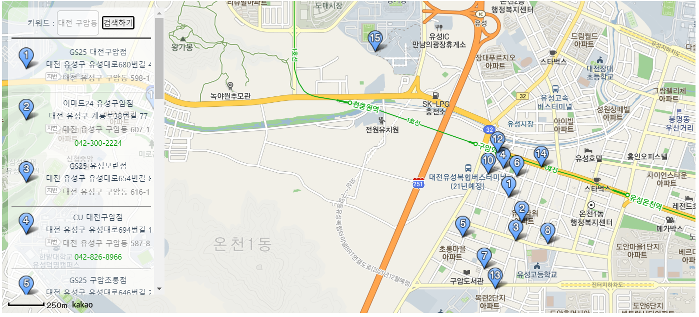

# 

>   1인 가구를 핵심 고객으로 설정하여 같은 지역 혹은 동네에 거주하는 고객들에게 "공동구매", "공동배달", "공동택배" 플랫폼을 제공합니다. 수령장소는 편의점으로 선정하여 안전하고, 공정한 분배를 기반합니다.

## Team 소개

#### 팀명: 욕망의 항아리(대전 2반 3팀) :trophy:

> 팀장: 김영호
>
> 팀원: 김영남, 송복민, 임기람, 이한솔, 차종욱

#### 역할 소개

#### Front-end

- 차종욱
- 임기람
- 이한솔

#### Back-end

- 김영호
- 송복민
- 김영남

## Features

#### 프로젝트 특징

##### :horse_racing: 공동배달

최소 주문 금액을 충족시켜 로켓 배송, 배달의 민족 등의 서비스를 넓은 폭으로 이용 가능합니다.

##### :package: 공동택배

쇼핑몰 하한 금액을 맞추어 배송비를 절약할 수 있습니다.

##### :family: 공동구매

대량 주문을 통해 원하는 만큼만 분배 받아 절약 가능합니다.

#### 기능

##### 회원관리

- 카카오 소셜 로그인
- 관리자 로그인
- 마이페이지
- 유저페이지
- 회원 정보 수정

##### 거래 게시판

##### 후기 게시판

##### 자유 게시판

##### 우리동네 거래 게시판

##### 관리자 페이지

- 유저 관리
- 신고 관리

##### 검색

##### 심화 기능

## Tech/Framework used

OS: Windows, Linux (Ubuntu)

#### Back-end

> - Spring
>
> - Docker
> - MariaDB

#### Front-end

> - Vue.js
> - Vuex
> - Bootstrap

## API Reference

#### Kakao Map api

> 장소ID, 키워드로 장소 검색 서비스 제공.

## Version control strategy

#### GitLab

## Thanks to...

