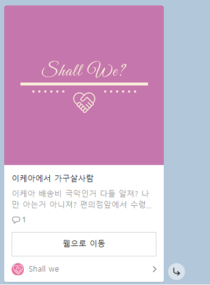

>배달 음식을 주문할 때, 온라인 쇼핑을 할 때, 최소 주문 금액 때문에 불필요한 소비를 줄여주는 공동구매 플랫폼을 제공합니다.

## Team 소개

#### 1. 팀명: 욕망의 항아리(대전 2반 3팀) :trophy:

> 철학자 자크 라캉의 '인간은 욕망하는 존재다.' 라는 말과 같이 모든 팀원이 프로젝트를 잘 마무리 하고 싶다는 욕망을 담는다는 뜻에서 팀이름을 욕망의 항아리로 지었습니다.

- 팀장: 김영호

- 팀원: 김영남, 송복민, 임기람, 이한솔, 차종욱

#### 2. 역할 소개

#### Front-end

- 차종욱
- 임기람
- 이한솔

#### Back-end

- 김영호
- 송복민
- 김영남

## Features

#### 1. 프로젝트 특징

##### :horse_racing: 쉘위배민

최소 주문 금액을 충족시켜 로켓 배송, 배달의 민족 등의 서비스를 넓은 폭으로 이용 가능합니다.

##### :package: 쉘위택배

쇼핑몰 하한 금액을 맞추어 배송비를 절약할 수 있습니다.

##### :family: 쉘위N빵

대량 주문을 통해 원하는 만큼만 분배 받아 절약 가능합니다.

#### 2. 기능

##### 반응형 웹 구현

##### 회원관리

- 카카오 소셜 로그인
- 관리자 로그인
- 마이페이지
- 유저페이지
- 회원 정보 수정

##### 거래 게시판

- 거래 프로세스 구현
- 찜하기
- 카카오톡 공유
- 사용자 참여 프로세스 구현
- 임시저장 서비스 제공

##### 후기 게시판

- SNS 형식의 게시판

##### 자유 게시판

- 공지 사항

##### 우리동네 거래 게시판

- 회원 정보에 기록된 주소 데이터로 추천 알고리즘 구현

##### 관리자 페이지

- 유저 관리
- 신고 관리
- 작성글 비활성화
- 댓글 비활성화
- 유저 비활성화

##### 검색

- 태그 검색
- 타이틀 검색
- 상세 검색

##### 심화 기능

- 참여자 통계 분석

## Tech/Framework used

OS: Windows, Linux (Ubuntu)

#### 1. DataBase

> - MariaDB
> - Docker

#### 2. Back-end

> - Spring Boot
>- JAVA

#### 3. Front-end

> - Vue.js
> - Vuex
> - Bootstrap
> - Bootstrap-vue

#### 4. Deploy

> - AWS
> - NGINX

## API Reference

#### 1. Kakao Map api

> 장소ID, 키워드로 장소 검색 서비스 제공.

#### 2. Kakao Social Login

> 카카오 계정 하나로 간편한 로그인 서비스 제공.

#### 3. Kakao 공유 서비스

> 카카오 친구들과 콘텐츠 공유를 할 수 있는 서비스 제공.

## Version control strategy

#### GitLab

